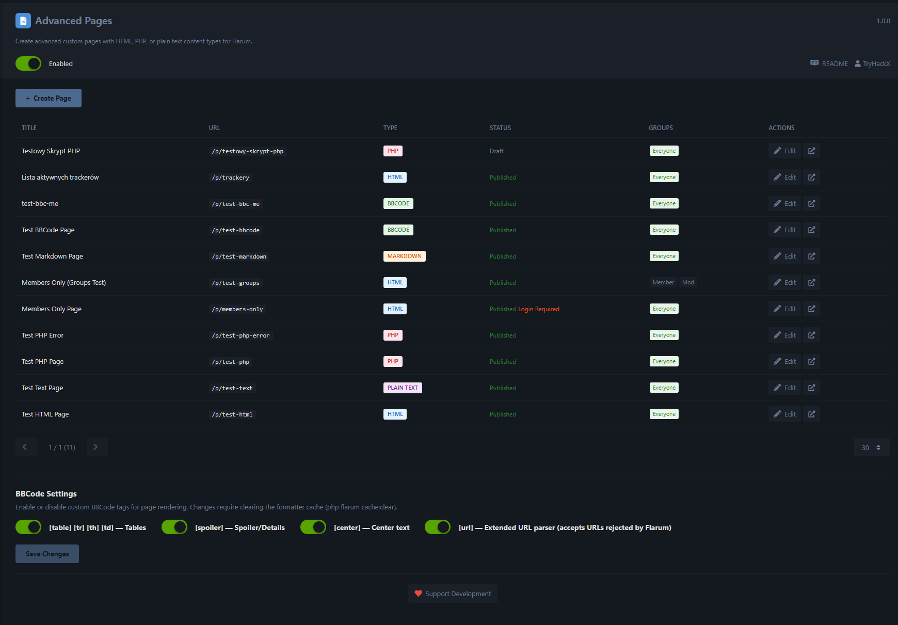

# Advanced Pages for Flarum

[](https://flarum.org)
[](https://packagist.org/packages/tryhackx/flarum-advanced-pages)
[](LICENSE)

Create advanced custom pages with **HTML**, **BBCode**, **Markdown**, **PHP**, or **plain text** content types for your Flarum 2.x forum. A powerful alternative to fof/pages with multi-format support, live preview, formatting toolbars, and granular access control.

## Features

- **5 content types** - HTML (HTMLPurifier sanitized), BBCode, Markdown, PHP (sandboxed), Plain Text
- **Formatting toolbars** - Context-aware buttons for BBCode and Markdown editors
- **Live preview** - Raw/Preview toggle with syntax highlighting (highlight.js One Dark)
- **Code editor** - CodeMirror-powered editor for HTML and PHP with syntax highlighting
- **BBCode extensions** - `[table]`, `[spoiler]`, `[center]`, extended `[url]` parser (configurable)
- **Newline modes** - Flarum vanilla or preserve-all for BBCode pages
- **Spoiler system** - `[spoiler]` / `[spoiler=Title]` with permission-based visibility
- **Admin panel** - Full CRUD with pagination, per-page selector, and inline settings
- **SEO support** - Meta descriptions and proper `<title>` tags
- **Access control** - Publish, hide (admin-only), restrict (login required), per-group visibility
- **Custom permissions** - Manage pages, view spoiler content
- **Clean URLs** - Pages accessible at `/p/{slug}`

## Screenshots



*Admin panel with page management, BBCode editor with toolbar, and live preview.*

## Support Development

If you find this extension useful, consider supporting its development:

- **Monero (XMR):** `45hvee4Jv7qeAm6SrBzXb9YVjb8DkHtFtFh7qkDMxS9zYX3NRi1dV27MtSdVC5X8T1YVoiG8XFiJkh4p9UncqWGxHi4tiwk`
- **Bitcoin (BTC):** `bc1qncavcek4kknpvykedxas8kxash9kdng990qed2`
- **Ethereum (ETH):** `0xa3d38d5Cf202598dd782C611e9F43f342C967cF5`

You can also find the donation option in the extension's admin settings panel.

## Requirements

- **Flarum** `^2.0`
- **PHP** `^8.1`
- **PHP memory_limit** `256M` minimum (512M+ recommended)

## Installation

```bash
composer require tryhackx/flarum-advanced-pages:"*"
php flarum migrate
php flarum cache:clear
```

## Updating

```bash
composer update tryhackx/flarum-advanced-pages
php flarum migrate
php flarum cache:clear
```

## Usage

### Creating Pages

1. Go to **Admin Panel** > **Advanced Pages**
2. Click **Create Page**
3. Choose a content type and write your content
4. Configure visibility (published, hidden, restricted, group access)
5. Save — page is available at `/p/{your-slug}`

### Content Types

| Type | Description | Security |
|------|-------------|----------|
| **HTML** | Full HTML with styles, scripts, forms | Raw output, permission-gated |
| **BBCode** | BBCode with custom tags & toolbar | Escaped and parsed via s9e/TextFormatter |
| **Markdown** | Full Markdown with live preview | Escaped and parsed via s9e/TextFormatter |
| **PHP** | Server-side PHP execution | Admin-only, sandboxed, errors logged never shown |
| **Plain Text** | Auto-escaped text with URL linking | Fully escaped output |

### BBCode Settings

Toggle custom BBCode tags in the admin settings:

| Setting | Tags | Default |
|---------|------|---------|
| Tables | `[table]` `[tr]` `[th]` `[td]` | Enabled |
| Spoiler | `[spoiler]` `[spoiler=Title]` | Enabled |
| Center | `[center]` | Enabled |
| Extended URL | `[url]` (accepts URLs rejected by Flarum) | Disabled |

Changes to BBCode settings require clearing the formatter cache:

```bash
php flarum cache:clear
```

### Newline Mode (BBCode)

Each BBCode page has a configurable newline mode:

- **Flarum** (default) - Multiple newlines collapse to a single break (vanilla Flarum behavior)
- **Preserve** - All newlines are respected as `<br>` tags

### PHP Pages

PHP pages execute in a sandboxed environment with access to:

- `$page` - The current Page model
- `$actor` - The current user (or `null` for guests)
- `$settings` - Flarum SettingsRepository

```php
<h1>Welcome, <?= htmlspecialchars($actor ? $actor->display_name : 'Guest') ?></h1>
<p>Current time: <?= date('Y-m-d H:i:s') ?></p>
```

Errors are logged to Flarum's log but never displayed to visitors.

### Page Visibility

| Option | Description |
|--------|-------------|
| **Published** | Page is accessible to permitted users |
| **Draft** | Page exists but is not accessible |
| **Hidden** | Only visible to administrators |
| **Restricted** | Requires login to view |
| **Group access** | Restrict to specific user groups |

### Permissions

| Permission | Location | Description |
|-----------|----------|-------------|
| Manage Advanced Pages | Moderate tab | Create, edit, delete pages |
| View spoiler content | View tab | See spoiler content on pages |

## Memory Requirements

Flarum compiles all extension LESS styles together. If you get a `PHP Fatal error: Allowed memory size exhausted`:

1. Set `memory_limit` to at least `256M` in `php.ini` (recommended: `512M`)
2. **WAMP users**: Apache with mod_fcgid uses `php.ini` in the Apache bin directory, not the PHP directory
3. Restart Apache after changes

## Security

- HTML pages rendered raw (full HTML/CSS/JS support) — page creation is permission-gated
- PHP execution sandboxed in isolated closure with custom error handling
- PHP errors never exposed to end users
- Only admins can create PHP pages
- Raw `content` field hidden from non-admin API responses
- URL scheme blocking (javascript:, data:, vbscript:) in extended URL parser
- Spoiler content stripped server-side for users without permission

## Links

- [GitHub](https://github.com/TryHackX/flarum-advanced-pages)
- [Packagist](https://packagist.org/packages/tryhackx/flarum-advanced-pages)
- [Report Issues](https://github.com/TryHackX/flarum-advanced-pages/issues)

## License

MIT License. See [LICENSE](LICENSE) for details.
