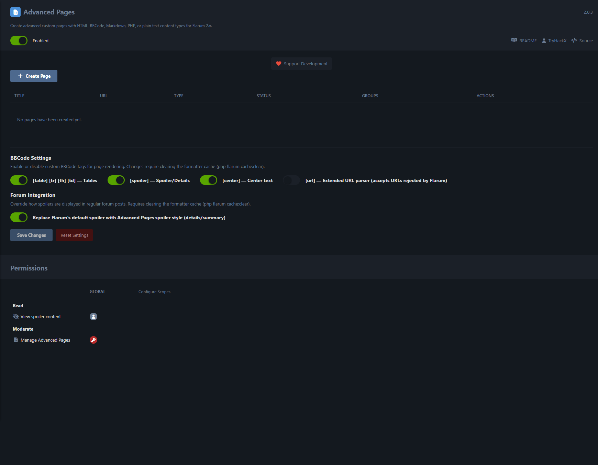
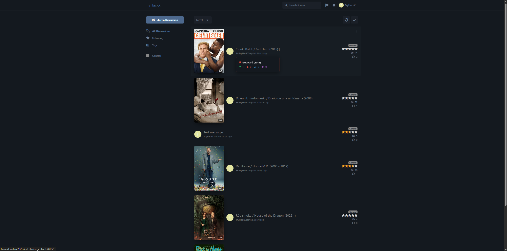

# Advanced Pages for Flarum

[](https://flarum.org)
[](https://packagist.org/packages/tryhackx/flarum-advanced-pages)
[](LICENSE)

Create advanced custom pages with **HTML**, **BBCode**, **Markdown**, **PHP**,
or **plain text** content types for your Flarum 2.x forum. A powerful
alternative to `fof/pages` with multi-format support, live preview,
formatting toolbars, and granular access control.

> **Latest highlights (2.1.0):**
> - **Nested / child pages** with a *Parent Page* selector, **drag-and-drop**
>   ordering & nesting in the admin (grab the `⋮⋮` handle), parent-chain
>   breadcrumbs, and optional **per-tree breadcrumb CSS** (style or hide them).
> - **Per-content-type creation permissions** — control who can create
>   Plain Text / BBCode / Markdown pages from the admin grid, and who can
>   create the sensitive **HTML** / **PHP** pages via a dedicated console
>   command (`php flarum advancedpages:permission`).
> - **Per-page "Allow script execution" toggle** — `<script>` tags in a
>   page now run only when you explicitly opt in (off by default).
> - **Cross-database visibility** — per-group visibility now works on
>   SQLite and PostgreSQL too, not just MySQL/MariaDB.
> - `$actor` now works inside PHP pages.

> **Note:** Advanced Pages targets the **2.x** line only (Flarum 2.x).

## Features

- **5 content types** — HTML (rendered raw — admin/permission-gated),
  BBCode, Markdown, PHP (server-side, admin/permission-gated), Plain Text.
- **Nested pages** — parent/child hierarchy with slash-based URLs and
  breadcrumbs.
- **Formatting toolbars** — context-aware buttons for the BBCode and
  Markdown editors.
- **Live preview** — Raw / Preview toggle with syntax highlighting
  (highlight.js One Dark).
- **Code editor** — CodeMirror-powered editor for HTML and PHP with
  syntax highlighting.
- **BBCode extensions** — `[table]`, `[spoiler]`, `[center]`, extended
  `[url]` parser (configurable).
- **Newline modes** — Flarum vanilla or *preserve-all* for BBCode pages.
- **Spoiler system** — `[spoiler]` / `[spoiler=Title]` with
  permission-based visibility (`advancedPages.viewSpoilers`, default
  Members).
- **Admin panel** — full CRUD with pagination, per-page selector,
  inline settings, *Save Changes* + *Reset Settings* buttons (Reset
  opens Flarum core's `ResetExtensionSettingsModal` populated with
  this extension's settings).
- **SEO support** — meta descriptions and proper `<title>` tags.
- **Access control** — publish, hide (admin-only), restrict
  (login-required), per-group visibility (works on MySQL/MariaDB,
  SQLite 3.38+ and PostgreSQL).
- **Granular permissions** — manage pages, view spoiler content, and
  per-content-type page creation (text/BBCode/Markdown in the admin
  grid; HTML/PHP via console command).
- **Clean URLs** — pages live at `/p/{slug}`, including nested paths
  like `/p/docs/getting-started`.

## Screenshots


*Mobile view — discussion list rendered with different combinations of TryHackX extensions (thumbnails + ratings + views, thumbnails + views, thumbnails only, ratings only, views only, vanilla Flarum).*



*Advanced Pages admin panel — page management, BBCode tag toggles (`[table]`, `[spoiler]`, `[center]`, extended `[url]`), forum spoiler replacement and the *Save Changes* / *Reset Settings* row, plus the *Manage Advanced Pages* and *View spoiler content* permissions.*



*Desktop discussion list with the full TryHackX stack — thumbnail sliders on the left, star ratings on the right, magnet button next to each topic.*


*Desktop discussion list — hover state showing the magnet tooltip loading inline (powered by `tryhackx/flarum-magnet-link`).*

## Support Development

If you find this extension useful, consider supporting its development:

- **Monero (XMR):** `45hvee4Jv7qeAm6SrBzXb9YVjb8DkHtFtFh7qkDMxS9zYX3NRi1dV27MtSdVC5X8T1YVoiG8XFiJkh4p9UncqWGxHi4tiwk`
- **Bitcoin (BTC):** `bc1qncavcek4kknpvykedxas8kxash9kdng990qed2`
- **Ethereum (ETH):** `0xa3d38d5Cf202598dd782C611e9F43f342C967cF5`

You can also find the donation option in the extension's admin settings panel.

## Requirements

- **Flarum** `^2.0`
- **PHP** `^8.1`
- **PHP memory_limit** `256M` minimum (512M+ recommended — see *Memory* below).

## Installation

```bash
composer require tryhackx/flarum-advanced-pages
php flarum migrate
php flarum cache:clear
```

## Updating

```bash
composer update tryhackx/flarum-advanced-pages
php flarum migrate
php flarum cache:clear
```

## Usage

### Creating pages

1. Go to **Admin Panel → Advanced Pages**.
2. Click **Create Page**.
3. Choose a content type and write your content.
4. Configure visibility (published, hidden, restricted, group access).
5. Save — the page is available at `/p/{your-slug}`.

### Content types

| Type | Description | Security |
| --- | --- | --- |
| **HTML** | Full HTML with styles / forms / (opt-in) scripts | **Rendered raw, NOT sanitised.** Creation gated by `advancedPages.create.html` (console-only). `<script>` runs only if *Allow script execution* is enabled per page. |
| **BBCode** | BBCode with custom tags & toolbar | Escaped and parsed via s9e/TextFormatter |
| **Markdown** | Full Markdown with live preview | Escaped and parsed via s9e/TextFormatter |
| **PHP** | Server-side PHP execution (`eval`) | **Full server privileges** — not a real sandbox. Creation gated by `advancedPages.create.php` (console-only). Errors logged, never shown. |
| **Plain Text** | Auto-escaped text with URL linking | Fully escaped output |

### BBCode toggles

| Setting | Tags | Default |
| --- | --- | --- |
| Tables | `[table]` `[tr]` `[th]` `[td]` | On |
| Spoiler | `[spoiler]` `[spoiler=Title]` | On |
| Center | `[center]` | On |
| Extended URL | `[url]` (accepts URLs Flarum rejects) | Off |
| **Replace Forum Spoiler** | swap Flarum's default `[spoiler]` for the Advanced Pages `details/summary` style across all posts | Off |

After toggling BBCode settings, clear the formatter cache:

```bash
php flarum cache:clear
```

### Newline mode (BBCode)

Per-page newline behaviour:

- **Flarum** *(default)* — multiple newlines collapse to a single break
  (vanilla Flarum behaviour).
- **Preserve** — all newlines become `<br>` tags.

### PHP pages

> ⚠️ PHP pages run via `eval()` with **full server privileges**. The closure
> only scopes the variables below — it is **not** a security sandbox. Treat the
> ability to create PHP pages as equivalent to shell access. By default only
> administrators can create them.

PHP page code runs in a closure with access to:

- `$page` — current Page model
- `$actor` — the current user. This is always a `User` object; for guests it is
  a guest instance (`$actor->isGuest() === true`), not `null`.
- `$settings` — Flarum `SettingsRepository`
- `$csrfToken` — the current session's CSRF token (see *Forms* below)
- `$pages` — read-only page-tree helper for nav menus (see *Building a nav menu* below)
- the usual PHP superglobals: `$_GET`, `$_POST`, `$_FILES`, `$_SERVER`, …

```php
<h1>Welcome, <?= htmlspecialchars($actor->isGuest() ? 'Guest' : $actor->display_name) ?></h1>
<p>Current time: <?= date('Y-m-d H:i:s') ?></p>
```

PHP errors are written to Flarum's log but never shown to visitors.

#### Forms, GET, POST and file uploads

PHP pages can read query strings and handle form submissions — including file
uploads — through the normal PHP superglobals:

- **GET** — `…/p/your-page?q=hello` → `$_GET['q']`. Works out of the box.
- **POST / file upload** — a `<form method="post">` (use
  `enctype="multipart/form-data"` for files) submits **back to the same page**
  URL; read `$_POST` / `$_FILES`. Because the page lives on a normal forum route,
  Flarum's CSRF protection applies, so the form **must include the session
  token** — emit it with the `$csrfToken` variable:

```php
<?php if ($_SERVER['REQUEST_METHOD'] === 'POST'): ?>
  <p>You said: <?= htmlspecialchars($_POST['message'] ?? '') ?></p>
  <?php if (!empty($_FILES['file']['name'])): ?>
    <p>Uploaded: <?= htmlspecialchars($_FILES['file']['name']) ?>
       (<?= (int) $_FILES['file']['size'] ?> bytes)</p>
  <?php endif; ?>
<?php endif; ?>

<form method="post" enctype="multipart/form-data">
  <input type="hidden" name="csrfToken" value="<?= htmlspecialchars($csrfToken) ?>">
  <input name="message" placeholder="Say something">
  <input type="file" name="file">
  <button type="submit">Send</button>
</form>
```

A POST without a valid `csrfToken` is rejected with HTTP 400 — this is Flarum's
standard CSRF protection, not a limitation of the extension. (A live demo page
ships at `/p/php-request-test`.)

#### Building a nav menu — the `$pages` tree helper

PHP pages get a read-only `$pages` helper for walking the page tree, so you can
generate a navigation menu, a sidebar, a sitemap, etc. **It only ever returns
pages the current viewer is allowed to see** (drafts, hidden, restricted and
per-group pages are filtered out automatically) and is ordered to match the
admin tree — so menus never leak hidden pages. The whole visible set is loaded
in a single query, no matter how many calls you make.

| Method | Returns |
| --- | --- |
| `$pages->all()` | All visible pages (flat, ordered). |
| `$pages->roots()` | Top-level pages (no parent). |
| `$pages->children($slug)` | Direct children of a page (by slug, id or Page). |
| `$pages->tree($slug)` | Nested `['page' => Page, 'children' => [...]]` array — pass a slug (e.g. `'docs'`) for that subtree, or nothing for the whole forest. |
| `$pages->find($slug)` | A single page by slug or id (or `null`). |
| `$pages->ancestors($page)` | The parent chain (root → immediate parent). |

Each `Page` exposes `->title`, `->slug`, `->content_type`, `->is_published`, etc.

```php
<?php
// A nested <ul> menu of everything under /p/docs (visibility-aware).
function ap_menu(array $nodes): void {
    if (!$nodes) return;
    echo '<ul>';
    foreach ($nodes as $node) {
        $p = $node['page'];
        printf('<li><a href="/p/%s">%s</a>',
            htmlspecialchars($p->slug), htmlspecialchars($p->title));
        ap_menu($node['children']); // recurse into children
        echo '</li>';
    }
    echo '</ul>';
}

ap_menu($pages->tree('docs'));
?>
```

### Nested pages, ordering & breadcrumbs

Pages form a tree. **The hierarchy (parent + order) is the organisation; the
slug is the independent URL.** A child page renders breadcrumbs built from its
parent chain (each ancestor links to its own page).

Two ways to organise pages:

- **Parent Page selector** in the editor — pick a parent (for a brand-new page it
  also suggests a matching child slug, which you can edit).
- **Drag and drop** in the admin list — grab the `⋮⋮` handle at the end of a row
  and:
  - drop it **onto** another page to nest it underneath, or
  - drop it **between** rows to reorder it at that level.

  Order is saved per parent; a page can't be dropped into its own subtree.

Slugs may be a slash path (e.g. `docs/getting-started`) or flat — your choice;
they accept lowercase `a-z0-9-` segments joined by single `/` (no leading,
trailing or doubled slashes).

#### Per-tree breadcrumb styling

On a **root** page (Parent Page = *none*), tick **Custom breadcrumbs CSS?** to
reveal a small CSS editor. Whatever you write applies to the breadcrumbs of that
page and everything nested under it — target `.AdvancedPages-breadcrumbs`. For
example, hide them entirely:

```css
.AdvancedPages-breadcrumbs { display: none; }
```

### Page visibility

| Option | Description |
| --- | --- |
| **Published** | Accessible to permitted users. |
| **Draft** | Page exists but is not accessible. |
| **Hidden** | Only visible to administrators. |
| **Restricted** | Requires login to view. |
| **Group access** | Restrict to specific user groups. |

### Permissions

**Out of the box, only administrators can create, edit or delete pages.** To let
other groups help, you grant access in **two places**:

1. **The admin Permissions page** — for everyday things: who can create the safe
   page types (Plain Text, BBCode, Markdown), who can edit/delete pages, and who
   can see spoiler content. Just tick the boxes.
2. **One console command** — for the two *powerful* page types, **HTML** and
   **PHP**.

**Why are HTML and PHP separate?** An HTML page can run JavaScript in every
visitor's browser, and a PHP page runs code on your server. Letting a group
create those is a big deal, so it's deliberately kept **out of the clickable
admin panel** (you can't enable it by accident) and done from the server console
instead.

What each permission lets a group do:

| Permission | Where you grant it | Lets the group… |
| --- | --- | --- |
| Create: Plain Text / BBCode / Markdown | Admin → **Permissions** page | Create those (safe, escaped) page types. |
| Create: **HTML** | **Console** (below) | Create HTML pages (raw HTML/JS). |
| Create: **PHP** | **Console** (below) | Create PHP pages (server-side code). |
| Manage Advanced Pages | Admin → **Permissions** page | Edit & delete existing pages. |
| View spoiler content | Admin → **Permissions** page | See `[spoiler]` content (default: Members). |

> Editing also needs *Manage Advanced Pages*. On top of that, turning a page into
> — or editing — an HTML/PHP page needs that group's HTML/PHP create permission
> too, so a manager can't sneak executable code in without it.

#### The console command

```
php flarum advancedpages:permission <action> [<group>] [<type>] [--force]
```

- **`<action>`** — `list`, `grant`, or `revoke`.
- **`<group>`** — the group's name (e.g. `Members`, or `"Trusted Authors"` in
  quotes if it has a space) **or** its number. Run `list` to see the numbers.
- **`<type>`** — `text`, `bbcode`, `markdown`, `html`, `php`, or `all` (every
  create type at once). You can also pass `manage` (edit/delete) or `spoilers`.
- **`--force`** — only needed when granting `html`, `php` or `all`. It's a
  safety confirmation for the dangerous ones (revoking never needs it).

Recipes:

```bash
# See who can do what (and the group numbers)
php flarum advancedpages:permission list

# Let the "Members" group write Markdown pages (same as ticking the box)
php flarum advancedpages:permission grant Members markdown

# Let a "Trusted Authors" group build HTML pages (dangerous → needs --force)
php flarum advancedpages:permission grant "Trusted Authors" html --force

# Let a group create PHP pages — by group number this time
php flarum advancedpages:permission grant 4 php --force

# Let your moderators edit & delete any page
php flarum advancedpages:permission grant Mods manage

# Take a permission back
php flarum advancedpages:permission revoke Members markdown
```

Changes apply immediately — no cache clear. Administrators always have every
permission, so you can't (and don't need to) target them.

## Memory requirements

Flarum compiles all extension LESS styles together. If you get
`PHP Fatal error: Allowed memory size exhausted`:

1. Set `memory_limit` to at least `256M` in `php.ini`
   (`512M`+ recommended).
2. **WAMP users**: Apache with `mod_fcgid` uses the `php.ini` in the
   Apache bin directory, not the PHP directory.
3. Restart Apache after changes.

## Security

This extension intentionally lets trusted authors publish raw HTML and run
server-side PHP — that is the whole point. Understand the model before
delegating page creation:

- **HTML is rendered raw and is NOT sanitised.** Whoever can create HTML pages
  can publish arbitrary markup and (if *Allow script execution* is enabled on
  that page) JavaScript to every visitor. There is no HTMLPurifier. Treat
  `advancedPages.create.html` as "can run JS in every visitor's browser".
- **PHP pages run via `eval()` with full server privileges** — not a sandbox.
  Treat `advancedPages.create.php` as equivalent to shell access. PHP errors are
  logged, never shown to visitors.
- **Safe by default:** out of the box only administrators can create or edit
  pages. HTML and PHP creation can only be delegated via the
  `advancedpages:permission` console command (never an accidental panel click).
- `<script>` execution is **opt-in per page** (off by default).
- The raw `content` field is hidden from non-admin API responses (only the
  rendered output is exposed).
- Spoiler content is stripped server-side for users without
  `advancedPages.viewSpoilers`, regardless of the *Replace Forum Spoiler* setting.
- URL-scheme blocking (`javascript:`, `data:`, `vbscript:`) in the extended
  `[url]` BBCode parser.

## Database support

Works on every database Flarum 2.x supports — **MySQL / MariaDB, SQLite 3.38+,
and PostgreSQL** — including the per-group page visibility feature (uses
Laravel's cross-database JSON query builder).

## Note on cache clearing (Windows)

After `php flarum cache:clear` or enabling/disabling the extension, the very
first page load may briefly return `HTTP 500` and succeed on refresh. This is a
known Flarum/Symfony behaviour on **Windows** (the translation-catalogue cache
is rebuilt and concurrent first requests can collide on the file rename) — it
affects the whole forum, not just this extension, and clears itself once the
cache is warm. Loading any one page once after clearing the cache avoids it.

## Links

- [GitHub](https://github.com/TryHackX/flarum-advanced-pages)
- [Packagist](https://packagist.org/packages/tryhackx/flarum-advanced-pages)
- [Report Issues](https://github.com/TryHackX/flarum-advanced-pages/issues)

## License

MIT License. See [LICENSE](LICENSE) for details.
